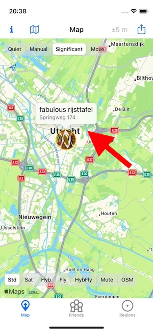

## POI and tags

Currently iOS only.

When manually publishing a location from the app, users have the possibility to set (or later clear) a tag.


Setting a tag causes all future publishes (manual or automatic) to have their JSON payloads enhanced with a "tag" element until it is manually cleared in the UI. The value of a tag is added to the JSON as

```json
{
  "_type": "location",
  "tag" : "<your tag>",
  ...
 
}
```

Tags can be used to group locations pertaining to a particular event (e.g. a specific trip or vacation).


Also when publishing a location a user can set a Point of Interest (POI) which is associated with the location being published. This POI is added once-only to the location message (contrary to a tag which is used until cleared):


```json
{
  "_type": "location",
  "lat": 17.065921,
  "lon": -96.717023,
  "poi": "Oaxaca, hotel Los Pilares",
  ...
}
```

iOS displays the Points of Interest as red bubbles on the map as shown above. The last POI and tags seen for a particular user are visible on the user's status page.

## POI and images

POI can also be submitted with a thumbnail of an photo selected from the Photos app. I take a photo using the normal iOS mechanisms to do this, and from within OwnTracks I can submit a POI (Point of Interest) with an associated image; the image is tagged with the _file name_ of the photo.

Choose to publish a new location from the map:


A new dialog opens when tapping on _Set POI with image_ in which an image from the photos library can be selected and set a POI text input, and the POI itself is shown on the Friend's details page


and the map displays the thumbnail of the photo




This thumbnail will also be shown on Friends' maps.

Our `"_type" : "location"` JSON payload is augmented with the image name, a POI text, and the image data of the thumbnail:

```json
{
  "_type": "location",
  "acc": 5,
  "alt": 0,
  "conn": "w",
  "created_at": 1734377867,
  "image": "/9j/42nS1Xn ... JfVKcX0R5mIy9+813P/9k=",
  "imagename": "IMG_0009",
  "lat": 52.085284,
  "lon": 5.120975,
  "m": 1,
  "poi": "fabulous rijsttafel",
  "t": "u",
  "tid": "JJ",
  "tst": 1734377712
}
```

The Recorder's API will return these larger payloads transparently.

## Notes

- POI are visible on iOS' map as long as they are locally stored on the device. This is controlled by the `positions` setting which indicates how many positions for a friend the device should keep in store (default: 200). As soon as least-recently-used positions containing POI (both _simple_ and _with image_) are removed from that store, the appropriate POI will not longer be visible on the map.

