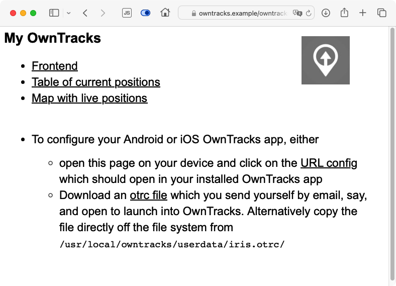

## Get started quickly

Using OwnTracks means having to set up and configure your own server, which can be non-trivial. For this reason we have created what we call _quicksetup_, a set of tools which will hopefully get your OwnTracks environment set up as effortlessly as possible.

To get started you'll need roughly an hour of time and a bit of love of a Linux command line. You'll also need the following:

- a small dedicated Linux-capable device (e.g. a Raspberry Pi or equivalent) or a dedicated Linux VPS (Virtual Private Server), either at your home or from one of the many VPS providers.
  - some offerings are free of charge, though you'll need patience to wade through their lingo. (Oracle cloud, Good Cloud, and possibly a few others have a free tier.)
  - we've had very good experience with the likes of DigitalOcean; at the time of this writing they have a 512MB Debian 12 VPS which serves us very well. But there are many others: Linode, Server4you, Hetzner, Netcup, ... look around and compare
  - we've tested this setup on Ubuntu 22.04 (_jammy_) and on Debian/Raspbian 12 (_bookworm_); anything older or different might well cause issues, but we'll gladly help if we can
- a DNS domain, something like `owntracks.example`, which will be associated with your VPS. Some VPS providers offer one in a package with the VPS. Be that as it may, the technical jargon is you let that DNS domain and associate the IPv4 and/or IPv6 address of your VPS with `owntracks.example`.
- if your Linux machine is at home, say, you'll need to open a few TCP ports in your router:
      - port `80` for Let's Encrypt enrollment and renewals only
      - port `443 `(optional) if you wish to permit authenticated access to your OwnTracks Web interface from "outside"
      - port `8883` the MQTT port

Before continuing, make sure you can login to your VPS, either as `root` or as an unprivileged user, but you will need to escalate privileges using `sudo`.

- after logging in, the following program invocation should produce output similar to that shown:

        $ sudo id
        uid=0(root) gid=0(root) groups=0(root)

- if you are prompted for a password, it will be your user password. After entering it you ought to see the output as above.

- also make sure the DNS domain you chose is associated with your VPS. You can probably test this by using the `ping` utility from your laptop. The machine might not actually be reachable, but you should see its IP address:

        $ ping owntracks.example
        ...

You should now be ready to proceed.

## What you can expect

Let's briefly describe what _quicksetup_ will actually attempt to accomplish so that you can follow along.

- we'll attempt to enroll your VPS with Let's Encrypt on your behalf in order to have an SSL (TLS) certificate issued with which the Web server and the MQTT broker on your VPS will be protected. This ensures that all communication via HTTP (to the Web server) and via MQTT (to the broker) will be encrypted. We also install a _cron_ job with which the Let's Encrypt certificate will automatically be renewed when required.
- we install an _nginx_ Web server so that you can login to use our Frontend and other Web-based tools. We generate random passwords with which you login, and you will later find these passwords on the system in files called `/usr/local/owntracks/userdata/*.pass`.
- we install a Mosquitto [MQTT broker](broker.md) in order for our Android or iOS apps to be able to publish [location data](../features/location.md) to your OwnTracks VPS. As mentioned earlier, communication between the apps and the broker is encrypted via SSL/TLS. We also create automatic configuration files so you can auto-configure the OwnTracks apps using our `*.otrc` files or a magic link on a Web page. The broker is configured to permit access only to users you specify with the same passwords we create randomly for the Web server.
- we install and configure our Recorder. This is a program which subscribes to MQTT (on your VPS) and receives location publishes when your OwnTracks apps change location. The data is stored and can later be viewed with Frontend.
- you will be able to specify any number of [Friends](../features/friends.md) during the configuration below. Each of these friends can use the MQTT broker, use the Web server, login with their username and different random password.

So, if everything works the way we hope it will, this ought to be a plug-and-play experience. Fingers crossed, let us begin.

## Launching quicksetup

You are logged into your VPS either as `root` or as an unprivileged user. Three steps will get the installer going:

1. ensure you are running a supported operating system (e.g. `bookworm`) by running

        $ hostnamectl
        ...
        Operating System: Debian GNU/Linux 12 (bookworm)
        ...

2. obtain our _quicksetup_ installer; we can't do this for you, but it's easy: you clone our repository.

        $ sudo apt install -y git    # not required on Ubuntu
        $ git clone --depth=1 https://github.com/owntracks/quicksetup
        $ cd quicksetup

3. you now have all the files on your system, so feel free to look around. If you just want to continue, make a copy of the configuration and edit it with an editor. The file's content ought to be self-explanatory, but [do ask us](https://github.com/owntracks/quicksetup/issues) if it isn't.

        $ cp configuration.yaml.example configuration.yaml
        $ nano configuration.yaml

4. the configuration file requires the following settings:

      - `dns_domain` is the DNS name of your system as reacheable from the Internet. You will set this to, say, `owntracks.example`. Make sure you replace this value by the correct name for your installation.
      - `email` is the email address which we will use when enrolling a Let's Encrypt certificate on your behalf. We don't use this for anything else, and Let's Encrypt will send you mail only when your certificate is about to expire. You can omit this setting in which case we will configure Quicksetup without TLS/SSL; we don't recommend this, but it might be good for simple testing.
      - we strongly recommend you sign up for the free reverse geo service at [OpenCage](../other/opencage.md). It's free of charge, and they provide you with an API key you add to `opencage_apikey`. This is used in determining address information for locations (example below), and we configure your OwnTracks Android app to use it. It's so much nicer when you can see the addresses of locations you've visited in our maps.
      - `friends` is an array of users who will be supported on your system. It will typically contain just yourself, but you might wish to have family members, relatives, or friends use OwnTracks on your system.

              friends:
                - { tid: JJ, username: jane,   devicename: nokia }
                - { tid: ip, username: jip,    devicename: iPad }
                - { tid: j2, username: jjolie, devicename: Phone }

        each line describes a _friend_, and you should be on the first line (we'll divulge later why that is). There are three fields on each line, all three are strings which may be enclosed in quotes. The _tid_ is displayed by default on the phone and must not be longer than two characters. The _username_ (with which you also login) and the _devicename_ form the _topic_ to which your devices will publish location data.

5. once you've edited the configuration file with the settings you wish, launch the installer which will install packages and configure services. Did you remember to open the TCP ports in your router?

        $ sudo ./bootstrap.sh

This last step will install a program which will begin the actual installation. The program is called Ansible and it uses a file provided by _quicksetup_ to begin configuring all the services as described above.

        PLAY [OwnTracks Quick Setup] ********************************************************

        TASK [Gathering Facts] **************************************************************
        ok: [localhost]

        TASK [system: template out sys.info] ************************************************
        changed: [localhost]

        TASK [verify some requirements] *****************************************************
        ok: [localhost] => {
            "changed": false,
            "msg": "All assertions passed"
        }

        TASK [detect: acme] *****************************************************************
        ok: [localhost]

        TASK [system: install OwnTracks repository key] *************************************
        changed: [localhost]

        TASK [system: install OwnTracks repository] *****************************************
        changed: [localhost]

        TASK [system: install required packages]
        ...

If all goes well you ought to see green and/or yellow lines only; no red diagnostics. Red means error, and the installer would halt. Some of the steps will take longer than others, for instance we install several software packages which takes a bit.

Should you wish to, say, add a friend at a later stage, edit `configuration.yaml`, and re-run `./bootstrap.sh` as you did earlier. As often as you wish.

## Initial testing

Assuming the installer was successful, you can verify if the services are working as we intended them to:

- install OwnTracks on your [Android or iOS device](apps.md) and configure it, either by
      - sending yourself one of the files from `/usr/local/owntracks/userdata/*.otrc`
      - visiting `https://owntracks.example/owntracks/` and logging with your _username_ (from the friends list in `configuration.yaml`) and the corresponding password from `/usr/local/owntracks/userdata/<username>.pass`. At the bottom of the page is a link you can click on from your Android/iOS device to automatically configure the app.
- in the app on the smartphone, click on the publish _up arrow_

     | Android                                         |        | iOS                              |
     | :---------------------------------------------: | :----: | :-----: |
     | {:.framed} | | {:.framed} |
   
- back on your VPS, use the following pre-configured utility to subscribe to your MQTT broker; by pre-configured we mean you won't need to specify username, password, hosts, etc:

        $ mosquitto_sub -v -t 'owntracks/#'

- on the console you should see some output from `mosquitto_sub` which looks a bit like this:

        owntracks/jane/nokia {"_type":"location","SSID":"mywifi","alt":154,"batt":53,"conn":"w","created_at":1706856299,"lat":48.856826,"lon":2.292713,"tid":"j1","tst":1706856298,"vel":0}

- the output on your system will differ. The first part before the first space, is called the [topic](topics.md) name. This is a kind of "address" to which your app publishes data, and each user on your system has a unique topic which has three parts: the constant `owntracks`, followed by the username, and the device name. After the initial space comes the actual location data your phone published. Let's format that neatly: you see the data includes a time stamp (`tst`), latitude and longitude (`lat`, `lon`), and a whole bunch of other values [you can look up](../tech/json.md#_typelocation) if you wish.

        {
          "_type": "location",
          "SSID": "mywifi",
          "alt": 154,
          "batt": 53,
          "conn": "w",
          "created_at": 1706858149,
          "lat": 48.856826,
          "lon": 2.292713,
          "tid": "j1",
          "tst": 1706858149,
          "vel": 0
        }

- still on the console, let's verify whether the Recorder has successfully saved the published location data. Note how the path name contains the _user_ and _device_ names used for publishing; the rest of the filename is a `YYYY-MM` date stamp:

        $ tail /var/spool/owntracks/recorder/store/rec/jane/nokia/2024-02.rec
        2024-02-02T07:15:49Z	*                 	{"_type":"location","SSID":"mywifi","alt":154,"batt":53,"conn":"w","lat":48.856826,"lon":2.292713,"tid":"j1","tst":1706858149,"vel":0}

- let's use a Web browser to access our site, where you'll be prompted for _username_ and _password_ as already mentioned:

      {:.framed}

- live map. The icon on the right of the info panel is what we call a [CARD](../features/card.md)

      {:.framed}

- _Frontend_ (below) is our primary data viewer which shows current locations (click on a bubble to find more details about a position)

      {:.framed}

- in _Frontend_ users can select users and devices to see, tracks to view, etc.

      {:.framed}

- back on the command line of your VPS, you can explore the data submitted by your devices using the `ocat` utility, say:

        $ ocat --user jane --device nokia | jq
        {
          "count": 1,
          "locations": [
            {
              "_type": "location",
              "SSID": "mywifi",
              "alt": 154,
              "batt": 53,
              "conn": "w",
              "lat": 48.856826,
              "lon": 2.292713,
              "tid": "j1",
              "tst": 1706858149,
              "vel": 0,
              "ghash": "u09tunj",
              "cc": "FR",
              "addr": "11 Av de Suffren, 75007 Paris, France",
              "locality": "Paris",
              "tzname": "Europe/Paris",
              "isorcv": "2024-02-02T07:15:49Z",
              "isotst": "2024-02-02T07:15:49Z",
              "isolocal": "2024-02-02T08:15:49+0100"
              "disptst": "2024-02-02 07:15:49"
            }
          ]
        }

- Notice how the data has been enriched by the name of the time zone (`tzname`) at the location and the local time there (`isolocal`). In addition, OwnTracks has stored the address (`addr`) of the location, the `locality` or city if know, and the country code (`cc`) of the published location. This data is available because we've signed up for an account and configured our system to use [OpenCage](../other/opencage.md). If you're curious about the geohash (`ghash`), it's a [convenient way of expressing a location using a short string](https://en.wikipedia.org/wiki/Geohash).

- the data you obtain locally from our Recorder is also available [via its API](https://github.com/owntracks/recorder/blob/master/API.md)

        $ curl -u jane -sSf 'https://owntracks.example/owntracks/api/0/locations' \
             -d user=jane -d device=nokia
        Enter host password for user 'jane':
        {"count":1,"data":[{"_type":"location","SSID":"mywifi","alt":154,"batt":53,"conn":"w","lat":48.856826,"lon":2.292713,"tid":"j1","tst":1706858149,"vel":0,"ghash":"u09tunj","cc":"FR","addr":"11 Av de Suffren, 75007 Paris, France","locality":"Paris","isorcv":"2024-02-02T07:15:49Z","isotst":"2024-02-02T07:15:49Z","disptst":"2024-02-02 07:15:49"}],"status":200}

## Debugging

There's quite a bit going on in the background, so we want to give you some tips on how to go about debugging or finding out what's actually going on.

- Verify the required services are running:

        $ systemctl status ot-recorder
        $ systemctl status mosquitto
        $ systemctl status nginx

- The MQTT broker logs information on incoming requests:

        $ tail -f /var/log/mosquitto/mosquitto.log

- You'll likely also want to see the payloads the MQTT broker is getting; do so by subscribing to all topics:

        $ mosquitto_sub -v -t '#'

- The OwnTracks Recorder prints diagnostics to its console, but that console is typically not visible as it's a background service. Use _journalctl_ or _syslog_ on Ubuntu

        $ journalctl -u ot-recorder -f
        $ tail -f /var/log/syslog | grep ot-recorder

- When `jane` has successfully published a location from her device (here: `nokia`), verify it's actually arrived at your recorder:

        $ tail /var/spool/owntracks/recorder/store/jane/nokia/YYYY-MM.rec

If you need more help, we'll gladly help you if we can. Even if all you've found is a glitch in our documentation, we consider that a bug [so please report it](https://github.com/owntracks/quicksetup/issues). You might want to keep a copy of the file `sys.info` handy which should have been created by bootstrapping process in the directory from which you launched it:

        $ cat sys.info
        Last bootstrap: 2024-02-08T13:18:43Z

        Ansible version: 2.14.3
        OS distro: Debian / 12 4
        OS distribution: bookworm

## Where to go from here

There's a lot you can do with OwnTracks and its backend, so you might want to read up on some of the features:

- Learn about [geofences or waypoints](../features/waypoints.md) and [Points of Interest](../features/poi.md)
- Explore [Friends](../features/friends.md) and learn how to configure [Cards](../features/card.md)
- On iOS you can configure [Tours](../features/tours.md) you share with other people, and even utilize its [pedometer data](../features/pedometer.md)
- [Compare our apps on Android and iOS](../features/comparison.md)
- [MQTT broker bridging](bridge.md) is useful for connecting two backends together, yours and a friend's, say.
- Learn what you can do with OwnTracks data with [some programming](../tech/program.md) and with [Lua hooks](../tech/lua.md).
- See which [other settings you can use in `configuration.yaml`](../features/qs-config.md).
- Learn about [extra features of quicksetup](../features/qs-extra.md).
